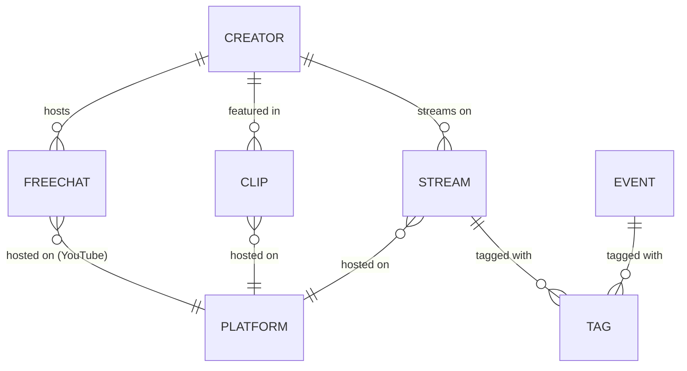

# Entities

## Entity Catalog

| Entity | Aggregate | Source | Description |
| --- | --- | --- | --- |
| Stream | Stream | External API | A livestream or VOD from a VSPO! creator on any supported platform |
| Creator | Creator | External API | A VSPO! member or affiliated content creator with channels across platforms |
| Clip | Clip | External API | A fan-made highlight clip or short derived from stream content |
| Event | Event | External API | A scheduled event such as a tournament, collab, or special broadcast |
| FreeChat | FreeChat | External API | A standing free-chat room on YouTube (always-open chat space) |
| SiteNews | SiteNews | Local | Announcement or changelog entry for the vspo-portal application itself |

## Relationships

- A **Creator** has many **Streams**, **Clips**, and **FreeChats** (linked via `rawChannelID`).
- **Stream**, **Clip**, and **FreeChat** each belong to exactly one **Platform**.
- **FreeChat** is structurally identical to Stream but represents a persistent chat room rather than a broadcast.
- **Event** is independent of Creator/Stream and represents scheduled occurrences.
- **SiteNews** is application-local and has no relationship to API entities.

---

## Entity Details

### 1. Stream

A livestream, VOD, or broadcast from a VSPO! creator on a supported platform.

| Attribute | Type | Required | Description |
| --- | --- | --- | --- |
| id | string | yes | Unique identifier |
| type | string | yes | Content type (e.g., `livestream`) |
| title | string | yes | Stream title |
| description | string | yes | Stream description text |
| platform | enum | yes | One of: `youtube`, `twitch`, `twitcasting`, `niconico`, `unknown` |
| tags | string[] | yes | Categorization tags |
| thumbnailUrl | string | yes | URL to the stream thumbnail image |
| channelId | string | yes | Platform-native channel ID of the creator |
| channelTitle | string | yes | Display name of the creator's channel |
| channelThumbnailUrl | string | yes | URL to the creator's avatar |
| viewCount | number | yes | Current or final view count |
| link | string | yes | Direct URL to the stream |
| videoPlayerLink | string | no | Embeddable video player URL |
| chatPlayerLink | string | no | Embeddable chat player URL |
| status | enum | yes | One of: `live`, `upcoming`, `ended`, `unknown` |
| scheduledStartTime | string | yes | ISO 8601 timestamp of the scheduled start time |
| scheduledEndTime | string or null | yes | ISO 8601 timestamp of the scheduled end time |

#### Business Rules

- `status` transitions follow: `upcoming` -> `live` -> `ended`.
- `scheduledEndTime` is null for streams that have not yet ended.
- `platform` determines which player links are available.

---

### 2. Creator

A VSPO! member or affiliated content creator. The API provides a full Creator entity, but the frontend domain maps it to a simplified **Channel** type for UI purposes.

#### API Entity (External)

The API returns a full Creator with nested channel objects per platform. See the API documentation for the complete shape.

#### Frontend Domain Model (Channel)

In the frontend domain (`channel.ts`), Creator is represented as a simplified `Channel`:

| Attribute | Type | Required | Description |
| --- | --- | --- | --- |
| id | string | yes | Unique identifier |
| name | string | yes | Display name |
| thumbnailURL | string | yes | URL to the creator's avatar |
| active | boolean | yes | Whether the creator is currently active (default: true) |
| memberType | string | yes | Member classification (e.g., `vspo_jp`, `vspo_en`, `vspo_ch`, `general`) |

#### Business Rules

- `memberType` determines UI grouping: `vspo_jp` (main JP roster), `vspo_en` (English branch), `vspo_ch` (Chinese branch), `general` (affiliated/external).
- The API-to-domain mapping discards per-platform channel details in favor of a flat structure.

---

### 3. Clip

A fan-made highlight clip. Extends the base video schema with a fixed `type` of `clip` and a `publishedAt` field.

| Attribute | Type | Required | Description |
| --- | --- | --- | --- |
| (all base video attributes) | | | Same as Stream (id, title, description, platform, tags, thumbnailUrl, viewCount, channelId, channelTitle, channelThumbnailUrl, link, videoPlayerLink, chatPlayerLink) |
| type | literal | yes | Always `clip` |
| publishedAt | string | yes | ISO 8601 timestamp of publication |

#### Business Rules

- Clips always have `type: clip` (the domain schema does not distinguish short-form videos at this level).
- Clips are pre-recorded uploads.

---

### 4. Event

A scheduled event such as a tournament, collaboration, or special broadcast.

| Attribute | Type | Required | Description |
| --- | --- | --- | --- |
| id | string | yes | Unique identifier |
| type | string | yes | Event type |
| title | string | yes | Event title |
| startedDate | string | yes | ISO 8601 date string for the event start |
| contentSummary | any | no | Summary content for the event (structure varies) |
| isNotLink | boolean | no | Whether the event should not be rendered as a link |

#### Business Rules

- Events are date-based (not time-precise like streams).
- `isNotLink` controls whether the event is rendered as a clickable link in the UI.

---

### 5. FreeChat

A standing free-chat room on YouTube. Structurally identical to Stream.

| Attribute | Type | Required | Description |
| --- | --- | --- | --- |
| (all Stream attributes) | | | Same as Stream |

#### Business Rules

- FreeChats are always on YouTube (`platform: youtube`).
- FreeChats typically have `status: upcoming` or `live` indefinitely -- they are persistent chat rooms, not time-bounded broadcasts.
- Filtering by `memberType` is supported through the associated Creator's channel.

---

### 6. SiteNews

Application-local announcement or changelog entry. Stored as markdown files under `public/content/site-news/{locale}/`, not sourced from the external API.

| Attribute | Type | Required | Description |
| --- | --- | --- | --- |
| id | number | yes | Numeric identifier (from markdown frontmatter) |
| title | string | yes | News title |
| content | string | yes | News body text (markdown) |
| html | string or null | no | Rendered HTML content |
| updated | string | yes | ISO 8601 last-updated timestamp |
| tags | enum[] | yes | One or more of: `feat`, `fix` |
| tweetLink | string | no | URL to a related tweet/post |

#### Business Rules

- `tags` categorize the news entry as a feature announcement (`feat`) or bug fix notice (`fix`).
- SiteNews is stored as locale-specific markdown files and parsed at build/request time via `lib/markdown.ts`.
- The `SiteNewsMarkdownItem` type in code corresponds to this entity.
