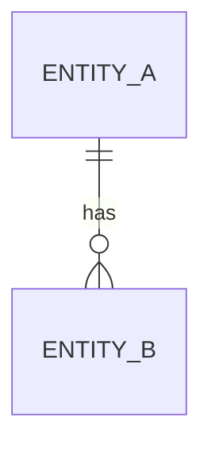

# Entities

## エンティティ一覧

| エンティティ | 英語名 | 集約 | 説明 |
| --- | --- | --- | --- |
| TBD | TBD | TBD | TBD |

## 集約と関係



## エンティティ詳細

### 1. TBD

- 日本語名: TBD
- 英語名: TBD
- 集約ルート: TBD
- 目的: TBD

#### 主要属性

| 属性 | 型 | 必須 | 説明 |
| --- | --- | --- | --- |
| id | string | yes | 識別子 |

#### ビジネスルール

- TBD

#### 関連エンティティ

- TBD

#### Zod Schema Draft

```ts
import { z } from "zod";

export const tbdSchema = z.object({
  id: z.string(),
});

export type Tbd = z.infer<typeof tbdSchema>;
```

#### コンパニオンオブジェクト Draft

```ts
export const Tbd = {
  new: (props: Tbd): Tbd => props,
} as const;
```
