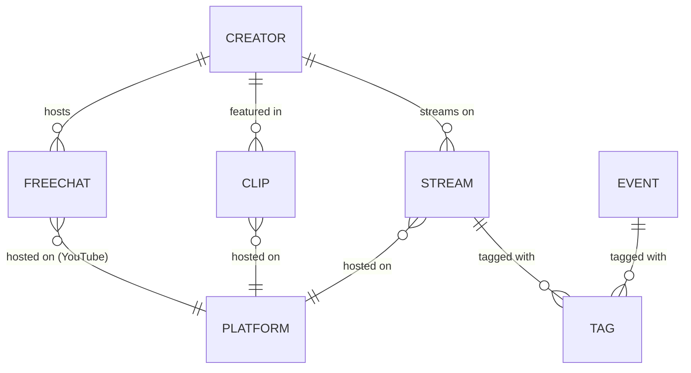

# Entities

## Entity Catalog

| Entity | Aggregate | Source | Description |
| --- | --- | --- | --- |
| Stream | Stream | External API | A livestream or VOD from a VSPO! creator on any supported platform |
| Creator | Creator | External API | A VSPO! member or affiliated content creator with channels across platforms |
| Clip | Clip | External API | A fan-made highlight clip or short derived from stream content |
| Event | Event | External API | A scheduled event such as a tournament, collab, or special broadcast |
| FreeChat | FreeChat | External API | A standing free-chat room on YouTube (always-open chat space) |
| SiteNews | SiteNews | Local | Announcement or changelog entry for the Spodule application itself |

## Relationships

- A **Creator** has many **Streams**, **Clips**, and **FreeChats** (linked via `rawChannelID`).
- **Stream**, **Clip**, and **FreeChat** each belong to exactly one **Platform**.
- **FreeChat** is structurally identical to Stream but represents a persistent chat room rather than a broadcast.
- **Event** is independent of Creator/Stream and represents scheduled occurrences.
- **SiteNews** is application-local and has no relationship to API entities.

---

## Entity Details

### 1. Stream

A livestream, VOD, or broadcast from a VSPO! creator on a supported platform.

| Attribute | Type | Required | Description |
| --- | --- | --- | --- |
| id | string | yes | Unique identifier |
| rawId | string | yes | Platform-native video/stream ID |
| title | string | yes | Stream title |
| languageCode | string | yes | Language code (en, ja, cn, tw, ko, ...) |
| rawChannelID | string | yes | Platform-native channel ID of the creator |
| description | string | yes | Stream description text |
| publishedAt | string | yes | ISO 8601 timestamp of publication |
| platform | enum | yes | One of: `youtube`, `twitch`, `twitcasting`, `niconico`, `unknown` |
| tags | string[] | yes | Categorization tags |
| thumbnailURL | string | yes | URL to the stream thumbnail image |
| creatorName | string | no | Display name of the creator |
| creatorThumbnailURL | string | no | URL to the creator's avatar |
| viewCount | number | yes | Current or final view count |
| link | string | no | Direct URL to the stream |
| deleted | boolean | no | Whether the stream has been deleted |
| translated | boolean | no | Whether the title/description has been machine-translated |
| videoPlayerLink | string or null | yes | Embeddable video player URL |
| chatPlayerLink | string or null | yes | Embeddable chat player URL |
| status | enum | yes | One of: `live`, `upcoming`, `ended`, `unknown` |
| startedAt | string or null | yes | ISO 8601 timestamp when the stream started |
| endedAt | string or null | yes | ISO 8601 timestamp when the stream ended |

#### Business Rules

- `status` transitions follow: `upcoming` -> `live` -> `ended`.
- `startedAt` is null for `upcoming` streams that have not yet begun.
- `endedAt` is null for `live` and `upcoming` streams.
- `platform` determines which player links are available.

---

### 2. Creator

A VSPO! member or affiliated content creator with channels across multiple platforms.

| Attribute | Type | Required | Description |
| --- | --- | --- | --- |
| id | string | yes | Unique identifier |
| name | string | yes | Display name |
| memberType | enum | yes | One of: `vspo_jp`, `vspo_en`, `vspo_ch`, `general` |
| thumbnailURL | string | yes | URL to the creator's avatar |
| channel.youtube | object or null | no | YouTube channel information |
| channel.twitch | object or null | no | Twitch channel information |
| channel.twitCasting | object or null | no | TwitCasting channel information |
| channel.niconico | object or null | no | Niconico channel information |

#### Channel Object Shape

Each channel object (youtube, twitch, twitCasting, niconico) has the following shape when present:

| Attribute | Type | Required | Description |
| --- | --- | --- | --- |
| rawId | string | yes | Platform-native channel ID |
| name | string | yes | Channel display name |
| description | string | yes | Channel description |
| thumbnailURL | string | yes | Channel avatar URL |
| publishedAt | string | yes | ISO 8601 channel creation date |
| subscriberCount | number | yes | Current subscriber/follower count |

#### Business Rules

- `memberType` determines UI grouping: `vspo_jp` (main JP roster), `vspo_en` (English branch), `vspo_ch` (Chinese branch), `general` (affiliated/external).
- A Creator may have channels on zero or more platforms (all channel fields are nullable).

---

### 3. Clip

A fan-made highlight clip or short video. Structurally identical to Stream with an additional `type` field.

| Attribute | Type | Required | Description |
| --- | --- | --- | --- |
| (all Stream attributes) | | | Same as Stream |
| type | enum | yes | One of: `clip`, `short` |

#### Business Rules

- Clips always have `status: ended` (they are pre-recorded uploads).
- `type: short` indicates a short-form vertical video (e.g., YouTube Shorts).
- `type: clip` indicates a standard-length highlight clip.

---

### 4. Event

A scheduled event such as a tournament, collaboration, or special broadcast.

| Attribute | Type | Required | Description |
| --- | --- | --- | --- |
| id | string | yes | Unique identifier |
| title | string | yes | Event title |
| storageFileId | string | no | Reference to an associated image/file in storage |
| startedDate | string | yes | ISO 8601 date string for the event start |
| visibility | enum | yes | One of: `public`, `private`, `internal` |
| tags | string[] | yes | Categorization tags |

#### Business Rules

- `visibility: public` events are shown to all users.
- `visibility: private` and `visibility: internal` events are restricted (admin use).
- Events are date-based (not time-precise like streams).

---

### 5. FreeChat

A standing free-chat room on YouTube. Structurally identical to Stream.

| Attribute | Type | Required | Description |
| --- | --- | --- | --- |
| (all Stream attributes) | | | Same as Stream |

#### Business Rules

- FreeChats are always on YouTube (`platform: youtube`).
- FreeChats typically have `status: upcoming` or `live` indefinitely -- they are persistent chat rooms, not time-bounded broadcasts.
- Filtering by `memberType` is supported through the associated Creator's channel.

---

### 6. SiteNews

Application-local announcement or changelog entry. Not sourced from the external API.

| Attribute | Type | Required | Description |
| --- | --- | --- | --- |
| id | number | yes | Auto-incrementing identifier |
| title | string | yes | News title |
| content | string | yes | News body text |
| updated | string | yes | ISO 8601 last-updated timestamp |
| tags | enum[] | yes | One or more of: `feat`, `fix` |
| tweetLink | string | no | URL to a related tweet/post |

#### Business Rules

- `tags` categorize the news entry as a feature announcement (`feat`) or bug fix notice (`fix`).
- SiteNews is managed within the frontend codebase, not via the external API.
